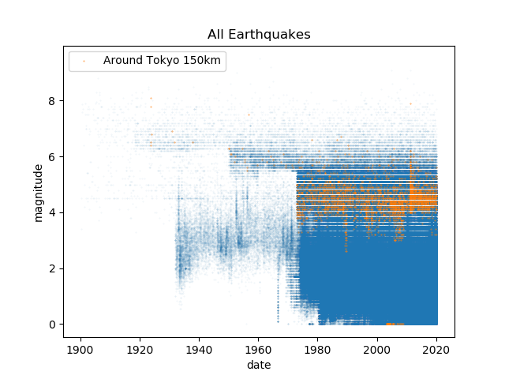
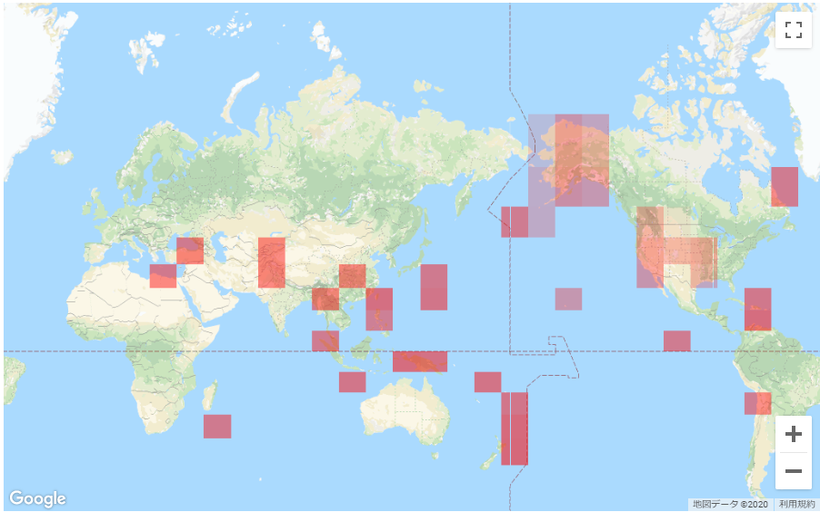
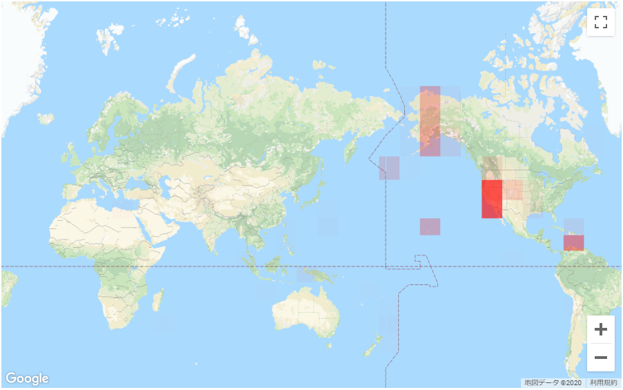
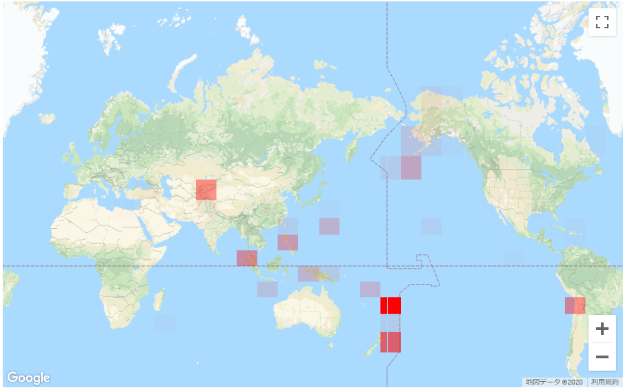
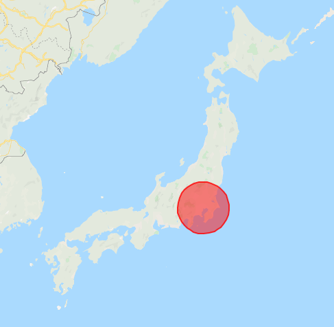

# ml-earthquake
Experiment kit for machine learning-based earthquake prediction, which may achieve "better than nothing" (ROC-AUC: 0.6~0.7) performance around Japan.

## Getting Started
```sh
python cmd/train --recipe_id tokyo
python cmd/predict --recipe_id tokyo --target_date 2020-02-23
```
Then see 
```
out/tokyo/summary.json
out/predictions.json
```
Edit recipe.json (or of course python codes) for your experiment.

## Implementation Details

### Source Data
All the earthquakes occured after 1980-01-01, recorded in USGS earthquake catalog ([https://earthquake.usgs.gov/earthquakes/search/](https://earthquake.usgs.gov/earthquakes/search/)).  
Data before 1980 is discarded because they have highly imbalanced frequency compared to later 1980, maybe because of old observation instruments.
<div align="center">
  
</div>

### Preprocess

```python
X.shape = [batch_size, days_range, latitude_granularity, longitude_granularity, num_of_channels]
```

Input **X** is generated from earthquakes occured on the specified range of days before the prediction target date.

Earthquakes are represented by **latitude index**, **longitude index**, **magnitude**, **frequency** (on a day), and **depth** (average in the latitude & longitude index).
Earthquakes of a day can be considered as 3 heatmaps of the world, and also an 2D image of 3 channels.
<div align="center">
  
  
  
</div>

```
y = 1 if earthquake occurs else 0
```

y is 1 only when an earthquake greater than specified magnitude occured inside the specified circle area, otherwise 0.
<div align="center">
  
</div>

Generally, positive/negative rate is imbalanced for earthquake data, so resampled by some methods (RandomUnderSampler, SMOTE, etc).

### Model
Uses [ConvLSTM2D](https://keras.io/ja/layers/recurrent/).
```
_________________________________________________________________
Layer (type)                 Output Shape              Param #
=================================================================
conv_lst_m2d_1 (ConvLSTM2D)  (None, 20, 30, 30)        35760
_________________________________________________________________
batch_normalization_1 (Batch (None, 20, 30, 30)        120
_________________________________________________________________
flatten_1 (Flatten)          (None, 18000)             0
_________________________________________________________________
dense_1 (Dense)              (None, 100)               1800100
_________________________________________________________________
dropout_1 (Dropout)          (None, 100)               0
_________________________________________________________________
dense_2 (Dense)              (None, 1)                 101
=================================================================
Total params: 1,836,081
Trainable params: 1,836,021
Non-trainable params: 60
_________________________________________________________________
```

### Performance

Currently, just "better than nothing" (ROC-AUC 0.6~0.7).  
Hoping somebody's breakthrough!
